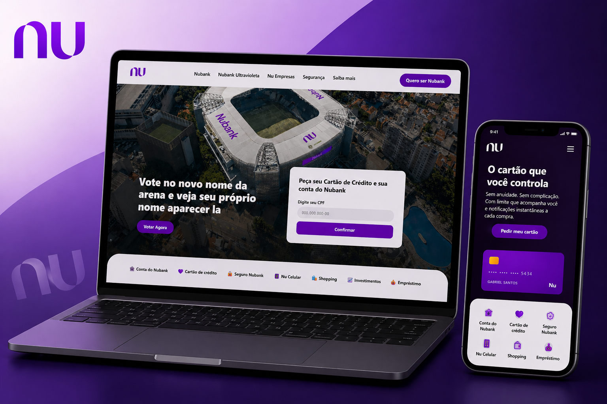

# 💜 Nubank Landing Page

<p align="center">
  
</p>

<p align="center">
  <a href="https://gabrieldosantosribeiro.github.io/site-nubank-dev-club/" target="_blank">
    
  </a>
</p>

---

## 🌐 Acesse o projeto

Você pode visualizar o projeto funcionando aqui:

👉 https://gabrieldosantosribeiro.github.io/site-nubank-dev-club/

---

## 📖 Sobre o projeto

Este projeto consiste em uma **landing page inspirada no site do Nubank**, desenvolvida utilizando **HTML e CSS**.

O projeto foi construído com base em um tutorial do canal DevClub, com o objetivo de praticar a criação de interfaces modernas e responsivas.

---

## 🚀 Tecnologias utilizadas

* HTML5
* CSS3

---

## 💡 Funcionalidades

* Layout moderno inspirado em fintech
* Estrutura de landing page
* Seções organizadas e bem definidas
* Interface responsiva
* Destaque para elementos visuais e design

---

## 📦 Como executar

1. Clone o repositório:

```bash
git clone https://github.com/gabrieldosantosribeiro/site-nubank-dev-club.git
```

2. Acesse a pasta:

```bash
cd site-nubank-dev-club
```

3. Abra o arquivo:

```bash
index.html
```

---

## 🎯 Objetivo

O objetivo deste projeto foi praticar a construção de layouts modernos utilizando HTML e CSS, com foco em design, organização e responsividade.

---

## 📌 Observações finais

Este projeto foi desenvolvido durante meus estudos em front-end, utilizando um tutorial como base para aprendizado e prática.
